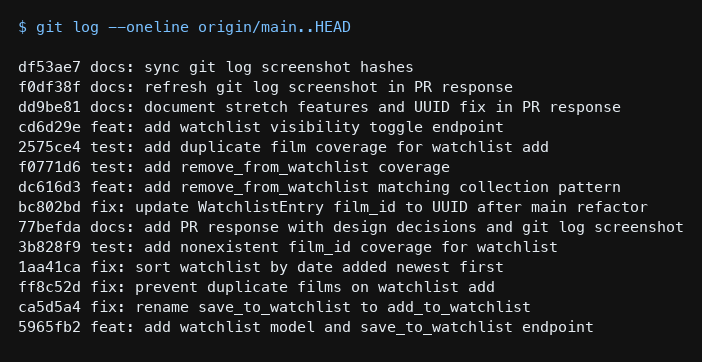

# PR Response Doc — CineLog Watchlist Feature

## AI Usage
Used AI in Milestone 1 to orient on `models.py`, `add_to_collection()`, and the collection test patterns before reading review comments — then verified those summaries against the code.

For Comments 4 and 5, drafted my own positions first, then asked AI to play devil's advocate ("What counterargument would a careful reviewer raise? What tradeoff am I not acknowledging?"). That pushed me to (4) spell out that public-by-default only works if the privacy control is discoverable, and acknowledge spoiler/taste-leak risk more explicitly; and (5) address alphabetical scanning and FIFO (oldest-first) as real alternatives before committing to newest-first. The final arguments below are my own, grounded in CineLog as a community film tracker.

For Milestone 4, I pasted `git log --oneline origin/main..HEAD` and asked whether each message followed conventional commits and whether any commit bundled multiple logical changes. The check confirmed prefixes (`feat:`, `fix:`, `test:`, `docs:`) and one logical change per commit. I verified that myself against CONTRIBUTING.md before finalizing.

## Comment 1 — Rename
**What I did:** Renamed `save_to_watchlist()` to `add_to_watchlist()` in `services/watchlist_service.py` so it matches the project's `verb_to_noun` convention (`add_to_collection`, `remove_from_collection`, `get_collection`). Updated the import and the single call site in `routes/watchlist/watchlist.py`.
**How I verified:** Ran a project-wide search for `save_to_watchlist` — only the old definition and the route import/call existed; both were updated, and a follow-up search returned zero matches. Ran `pytest tests/ -v` after the rename.

## Comment 2 — Deduplication
**What I did:** Followed the same pattern as `add_to_collection()`: after confirming the film exists, query `WatchlistEntry` for the same `(user_id, film_id)`. If a row exists, raise `AlreadyInWatchlistError` instead of inserting a duplicate. Also wired the route to return 409 (same idea as collection returning 409 for `AlreadyInCollectionError`).
**How I verified:** Compared the new check line-by-line against `add_to_collection()` in `services/collection_service.py` (filter_by → `.first()` → raise). Ran `pytest tests/ -v` to confirm existing tests still pass.

## Comment 3 — Missing test
**What I did:** Created `tests/test_watchlist.py` with the same `app` / `sample_user` fixtures as `tests/test_collection.py`, and wrote `test_add_to_watchlist_nonexistent_film_raises` as the direct counterpart to `test_add_to_collection_nonexistent_film_raises` (same fake ID, same `pytest.raises(FilmNotFoundError)` assertion).
**How I verified:** Used `test_add_to_collection_nonexistent_film_raises` as the model. Ran `pytest tests/test_watchlist.py -v`, then `pytest tests/ -v` for the full suite.

## Comment 4 — Default visibility
**My position:** Keep `public=True` as the default for new watchlist entries.
**Reasoning:** CineLog is positioned as a *community* film tracker — users log and share taste, not just keep a private diary. A watchlist is a natural discovery surface (“what are you hoping to see next?”). Optimizing for that social behavior means reducing friction for sharing: if every new save starts private, most lists stay invisible unless the user remembers to flip a toggle, and friends/followers never see the signal. Public-by-default matches an app that wants mutual discovery without requiring an extra step on every add.
**Tradeoff acknowledged:** Privacy-by-default is safer, and a careful reviewer would note that “want to watch” can leak spoilers, unreleased interests, or taste someone isn’t ready to broadcast. Public-by-default only works if the privacy control is obvious and easy to change; otherwise we privilege growth over consent. I’m accepting that tradeoff for v1 because the product thesis is social — and we should treat an explicit, hard-to-miss opt-out as a follow-up requirement, not an afterthought. (Stretch work adds that opt-out via the visibility endpoint.)

## Comment 5 — Sort order
**My position:** Adopt the maintainer’s preference: sort by `date_added` descending (newest first).
**Reasoning:** A watchlist behaves like a growing queue of intent, not a static catalog. When someone opens their list, the useful question is usually “what did I add lately?” not “where does *Alien* fall alphabetically?” Newest-first also matches `get_collection()`, so collection and watchlist share one mental model. Alphabetical is better for long-term browsing of a known library; that is not the primary job of “films I still mean to watch.”
**Engagement with reviewer's point:** I agree that most users want recent additions first — that is the behavior I’m optimizing for. I also considered two alternatives a reviewer might push: (1) alphabetical for easier scanning of long lists, and (2) oldest-first FIFO if we treat the watchlist as a strict “watch in the order you saved” queue. Both are valid secondary modes, but neither is the better *default* for a social tracking app. I’m changing the default to `date_added.desc()`; if we need A–Z or FIFO later, those can be query params without changing the default.

## Comment 6 — Rebase
**What conflicted:** Rebased `feature/watchlist` onto `origin/main` (`git rebase origin/main`). Git reported a clean replay (no conflict markers), but the UUID migration on `main` had already rewritten `models.py`, and the original watchlist commit never carried `WatchlistEntry` as a patch against that post-refactor file. After rebase, `Film`/`CollectionEntry` used UUID string IDs, but the `WatchlistEntry` model class was missing — imports failed (`cannot import name 'WatchlistEntry'`). Docstrings/comments still said integer `film_id`.
**How I resolved it:** Restored `WatchlistEntry` on top of main’s UUID schema with `film_id = db.String(36)` (matching `Film.id` and `CollectionEntry.film_id`). Updated `add_to_watchlist` / route docs from integer/`pre-refactor` to UUID. Recorded this in commit `fix: update WatchlistEntry film_id to UUID after main refactor` (also added a unique constraint mirroring collection). Left `public=True` and the newest-first sort from Comments 4–5 intact.
**How I verified no conflict remains:** `git rebase` completed; `git log --merges origin/main..HEAD` is empty (linear history, no merge commits). Grep showed no remaining integer/`pre-refactor` film ID notes in watchlist code. `pytest tests/ -v` passes.

## Stretch features

### remove_from_watchlist()
**What I did:** Added `remove_from_watchlist(user_id, film_id)` following `remove_from_collection()`: look up the `(user_id, film_id)` row, raise `NotInWatchlistError` if missing, otherwise delete and commit. Exposed `DELETE /watchlist/<user_id>/remove` returning 200 on success and 404 when the film isn’t on the list.
**Tests:** `test_remove_from_watchlist_deletes_entry` (happy path) and `test_remove_from_watchlist_missing_raises` (missing entry → `NotInWatchlistError`). Commits: `feat: add remove_from_watchlist matching collection pattern` and `test: add remove_from_watchlist coverage`.

### Second test (beyond Comment 3)
**What I did:** Added `test_add_to_watchlist_duplicate_raises`, modeled on `test_add_to_collection_duplicate_raises`.
**Why this case:** Comment 3 covered nonexistent IDs; the next-highest risk after review Comment 2 was silent duplicate inserts. This test locks that behavior in. Commit: `test: add duplicate film coverage for watchlist add`.

### Visibility toggle endpoint
**What I did:** Added `set_watchlist_visibility(user_id, film_id, public)` and `PATCH /watchlist/<user_id>/visibility` with body `{ "film_id": "<uuid>", "public": true|false }`. New entries still default to `public=True` on the model; callers who want privacy flip an existing entry with this endpoint. Missing entries return 404 via `NotInWatchlistError`. Commit: `feat: add watchlist visibility toggle endpoint`.

## Commit history screenshot

`$ git log --oneline origin/main..HEAD`



```
(placeholder — refreshed in final docs commit)
```

No merge commits. Each commit uses conventional prefixes and one logical change.

## PR Description

### What this feature does
Adds a personal watchlist so users can save films they want to watch later. It introduces a `WatchlistEntry` model, service helpers (`add_to_watchlist`, `remove_from_watchlist`, `get_watchlist`, `set_watchlist_visibility`), and REST endpoints:

- `GET /watchlist/<user_id>` — list a user’s watchlist (newest first)
- `POST /watchlist/<user_id>/add` — add a film (`{ "film_id": "<uuid>" }`)
- `DELETE /watchlist/<user_id>/remove` — remove a film
- `PATCH /watchlist/<user_id>/visibility` — set `public` true/false for an entry

### Design decisions
1. **Default visibility (`public=True`):** Watchlist entries are public by default so CineLog stays discovery-friendly as a community film tracker. The tradeoff is weaker privacy until an obvious opt-out is exposed — that opt-out is the visibility PATCH endpoint.
2. **Sort order (newest first):** Watchlists default to `date_added` descending so recent saves surface first, matching `get_collection()` and the “what did I add lately?” mental model instead of alphabetical title order.

### How to manually test
```bash
python -m venv .venv
source .venv/bin/activate
pip install -r requirements.txt
python app.py
```

1. List films: `curl -s http://127.0.0.1:5000/films/ | python -m json.tool`
2. Add: `curl -s -X POST http://127.0.0.1:5000/watchlist/<user_id>/add -H 'Content-Type: application/json' -d '{"film_id":"<film_uuid>"}'`
3. List watchlist: `curl -s http://127.0.0.1:5000/watchlist/<user_id>`
4. Duplicate add → expect `409`
5. Missing film UUID → expect `404`
6. Toggle private: `curl -s -X PATCH http://127.0.0.1:5000/watchlist/<user_id>/visibility -H 'Content-Type: application/json' -d '{"film_id":"<film_uuid>","public":false}'`
7. Remove: `curl -s -X DELETE http://127.0.0.1:5000/watchlist/<user_id>/remove -H 'Content-Type: application/json' -d '{"film_id":"<film_uuid>"}'`
8. Or run: `pytest tests/ -v`
